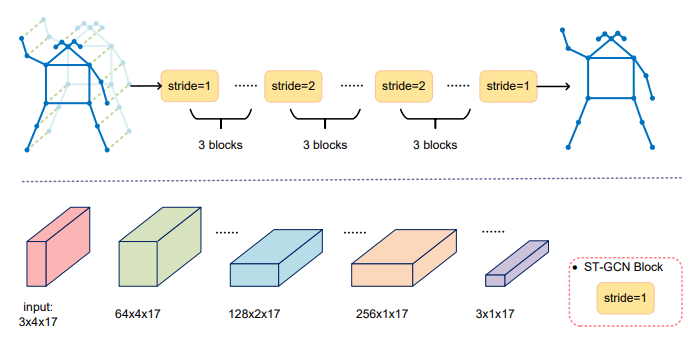

# Graph-Based Motion Prediction for Abnormal Action Detection

This is an official pytorch implementation of [Graph-Based Motion Prediction for Abnormal Action Detection](https://dl.acm.org/doi/abs/10.1145/3444685.3446316).  In this work,  we proposes human motion prediction for abnormal action detection. We employ sequence of human poses to represent human motion ,  and detect irregular behavior by comparing the predicted pose with the actual pose detected in the frame.

## Introduction

MP-GCN (motion prediction GCN)  employ sequence of human poses  to predict pose in the next frame. </br>



## Main Results

### Detection results on NJUST-Anomaly

|       Methods        |  AUC  |
| :------------------: | :---: |
|   FramePrediction    | 0.560 |
|    Autoregression    | 0.601 |
| SkeletonTrajectories | 0.709 |
|    Memory-guided     | 0.563 |
| Our method (MP-GCN)  | 0.732 |


## Environment

The code is developed using python 3.6 on Ubuntu 18.04.  NVIDIA GPUs are needed.  The code is developed and tested using 1 NVIDIA 2080Ti GPU.


## Quick start

### Installation

#### MP-GCN

1. Install pytorch >= v1.0.0 following [official instruction](https://pytorch.org/). **Note that if you use pytorch's version < v1.0.0, you should following the instruction at https://github.com/Microsoft/human-pose-estimation.pytorch to disable cudnn's implementations of BatchNorm layer. We encourage you to use higher pytorch's version(>=v1.0.0)**
2. Clone this repo, and we'll call the directory that you cloned as ${POSE_ROOT}.
3. Install dependencies:

```python
#Python3 Pytorch
#You can create a new conda environment for convenience.

pip install -r requirements.txt

cd torchlight; python setup.py install; 
```


### Data Preparation

1. NJUST-Anomaly data contains 137 videos, including 107 training videos and 30 test videos. You can download [here]() . The data should like this.

   ```
   ${NJUST-Anomaly data}
   |-- train
       `--|--videos
          | |-- 1.mp4
          | |-- 2.mp4
          | |-- 3.mp4
          | |-- ...
   `-- test
       `--|-- videos
          | |-- 1.mp4
          | |-- 2.mp4
          | |-- 3.mp4
          | |-- ...    
   ```


2. Get the human pose detection result

   We use [CenterNet](https://github.com/xingyizhou/CenterNet)+[Deep_sort](https://github.com/nwojke/deep_sort)+[HRNet](https://github.com/HRNet/HRNet-Human-Pose-Estimation) to get the human pose detection result. We provide the detection result, you can download [here]() . And you should put the data in ${POSE_ROOT}/pose. If you want to get the results yourself, you can follow the steps in the paper.

3. Screen poses according to the scores

   You should use the human pose detection result to choose the pose according to the scores . We porvide the processed data, you can download [here](). You should put the data in ${POSE_ROOT}/pose_choose. 

   And You can also generate the results yourself.

   ```
   python choose_pose.py
   ```

4. Motion decomposition

   You should use the human pose detection result to generate the Motion decomposition pose . We porvide the processed data, you can download [here](). You should put the data in ${POSE_ROOT}/pose_xy. 

     And You can also generate the results yourself.

     ```
   python pose_xy.py
     ```

5. Generate data for MP-GCN

   You should use the result in Screen poses according to the scores to generate the data for MP-GCN. We porvide the processed data, you can download [here](). You should put the jsondata.json in ${POSE_ROOT}/jsondata and label.json in ${POSE_ROOT}/label. Your directory tree should look like this.

   ```
   ${POSE_ROOT}
   ├── jsondata
   ├── label
   ├── mp_gcn
   ├── pose_choose
   └── pose_xy
   ```

   And You can also generate the results yourself.

   ```
   python json2json_oks.py
   ```

6. Generate data for **train** or **test**.

   You should use the result in Generate data for MP-GCN to generate data for train or test. We porvide the processed data, you can download [here](). You should put the data in ${POSE_ROOT}/mp_gcn. 

   And You can also generate the results yourself.

   ```python
   python tools/kinetics_gendata.py
   # line 82 & line 83
   # change path according to the generated data in Generate data for MP-GCN.
   ```


## Training and Testing 

##### Train on NJUST-Anomaly.

```python
python main.py recognition -c config/st_gcn/<dataset>/train.yaml

# change path in train.yaml according to your data
```

##### Testing on NJUST-Anomaly using model zoo's model ([GoogleDrive]())

```python
python main.py recognition -c config/st_gcn/kinetics-skeleton/test.yaml

# change path in test.yaml according to your data 
```


## Data Preparation for AUC value

1. You should get the test_result form Testing , and put it in the directory  the same as oks.py. We provide the test_result, you can download [here]().And  you can also generate yourself.

2. Put the label.json and mask in the directory  the same as oks.py. The label.json is the same as Generate data for MP-GCN. We porvide the mask, you can download [here](). Your directory should like this.

   ```
   ${mp_gcn}
   ├── mask
   ├── label.json
   └── test_result.pkl
   ```


## AUC value

```python
python oks.py
```


### Ciation

If you use our code or models in your research, please cite with:

```
@inproceedings{10.1145/3444685.3446316,
author = {Tang, Yao and Zhao, Lin and Yao, Zhaoliang and Gong, Chen and Yang, Jian},
title = {Graph-Based Motion Prediction for Abnormal Action Detection},
year = {2021},
isbn = {9781450383080},
publisher = {Association for Computing Machinery},
address = {New York, NY, USA},
url = {https://doi.org/10.1145/3444685.3446316},
doi = {10.1145/3444685.3446316},
booktitle = {Proceedings of the 2nd ACM International Conference on Multimedia in Asia},
articleno = {63},
numpages = {7},
keywords = {graph convolutional network, abnormal action detection, motion prediction},
location = {Virtual Event, Singapore},
series = {MMAsia '20}
}
```

### Acknowledgement

The codes are developed based on the opensource of [ST-GCN](https://github.com/yysijie/st-gcn/blob/master/OLD_README.md) .